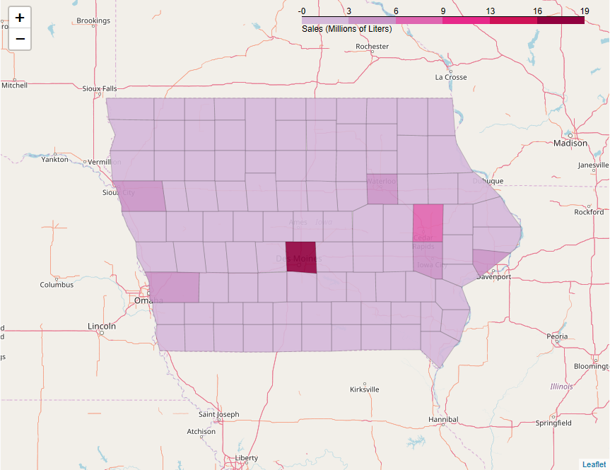

# Drink Worthy Data
Exploring the Iowa Liquor Sales dataset.

# Table of Contents
- [Exploratory data analysis](#exploratory-data-analysis)
    * [Taking a closer look at the data](#taking-a-closer-look-at-the-data)
        + [Who drinks the most?](#who-drinks-the-most)
        + [Who are the top 10 vendors in Iowa?](#who-are-the-top-10-vendors-in-iowa)
        + [What are Jim Beam's top selling liquors?](#what-are-jim-beam-top-selling-liquors)
        + [What is the price-response for Jim Beam 1750ml?](#what-is-the-price-response)
        + [Log-log price-response?](#log-log-price-response)
    * [Taking a closer look at demand (our response)](#taking-a-closer-look-at-demand)
        + [How has demand for Jim Beam 1750ml varied over time?](#how-has-demand-varied-over-time)
        + [How has change in demand varied over time?](#how-has-change-in-demand-varied-over-time)
        + [Comparing demand, % change, and log diff distributions.](#comparing-demand-change-and-log-diff-distributions)
        + [How do demand and change in demand vary month-to-month?](#how-do-demand-and-change-in-demand-vary-month-to-month)
    * [Taking a closer look at price (our predictor)](#taking-a-closer-look-at-price)
        + [How has price for Jim Beam 1750ml varied over time?](#how-has-price-varied-over-time)
        + [How has change in price varied over time?](#how-has-change-in-price-varied-over-time)
        + [Comparing price, % change, and log diff distributions.](#comparing-price-change-and-log-diff-distributions)
        + [How do price and change in price vary month-to-month?](#how-do-price-and-change-in-price-vary-month-to-month)
- [Developing a demand model](#developing-a-demand-model)
    * [Modeling approach](#modeling-approach)
    * [Hyperparameter tuning](#hyperparameter-tuning)
    * [Residual analysis](#residual-analysis)
    * [Error](#error)
- [Inferring seasonality and price elasticity](#inferring-seasonality-and-price-elasticity)
    * [Seasonality coefficients](#seasonality-coefficient)
    * [Price elasticity coefficient](#price-elasticity-coefficient)
- [Optimizing promotions to maximize profit](#optimizing-promotions-to-maximize-profit)
    * [Optimization approach](#optimization-approach)
    * [Profit curves](#profit-curves)

## Exploratory data analysis

### Taking a closer look at the data

#### Who drinks the most?

#### Who are the top 10 vendors in Iowa?

#### What are Jim Beam's top selling liquors?

#### What is the price-response for Jim Beam 1750ml?

#### Log-log price-response?

### Taking a closer look at demand (our response)

#### How has demand for Jim Beam 1750ml varied over time?

#### How has change in demand varied over time?

#### Comparing demand, % change, and log diff distributions.

#### How do demand and change in demand vary month-to-month?

### Taking a closer look at price (our predictor)

#### How has price for Jim Beam 1750ml varied over time?

#### How has change in price varied over time?

#### Comparing price, % change, and log diff distributions.

#### How do price and change in price vary month-to-month?

## Developing a demand model

### Modeling approach

### Hyperparameter tuning

### Residual analysis

### Error

## Inferring seasonality and price elasticity

### Seasonality coefficients

### Price elasticity coefficient

## Optimizing promotions to maximize profit

### Optimization approach

### Profit curves
